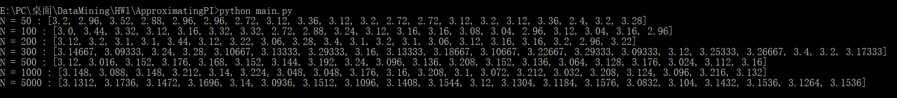
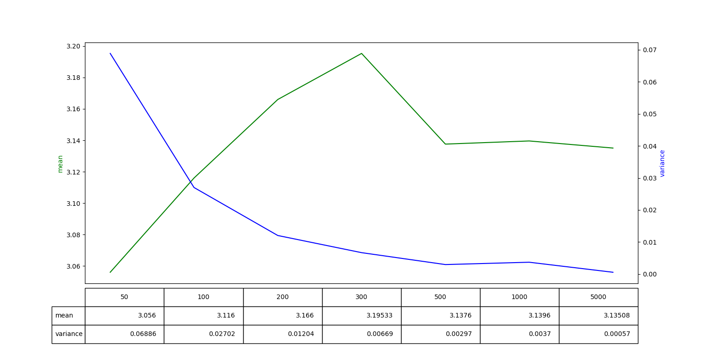
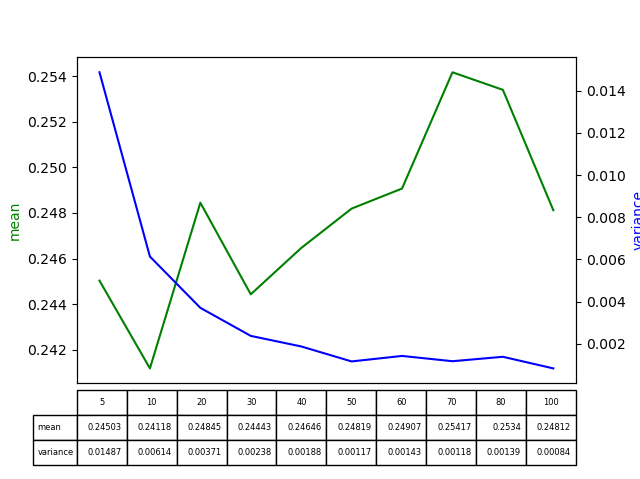
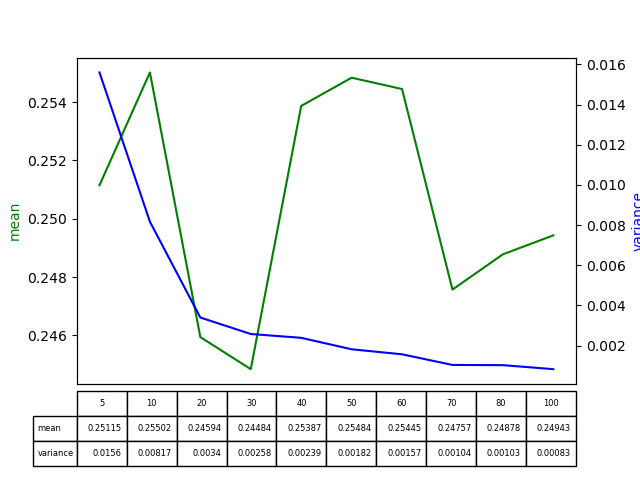
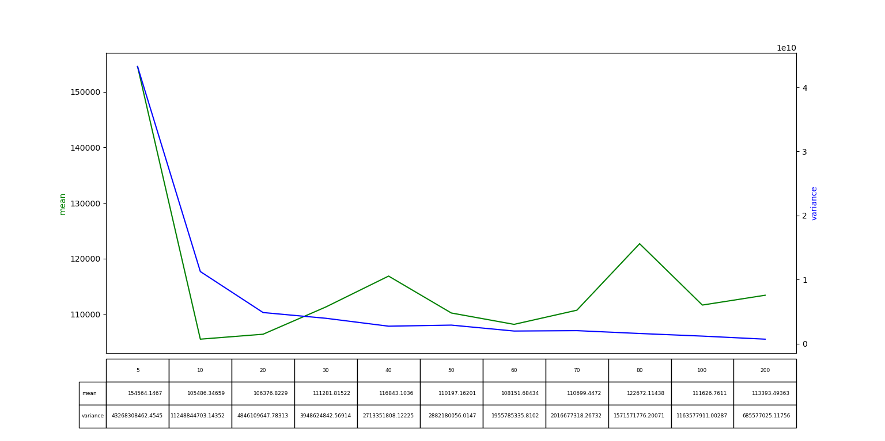
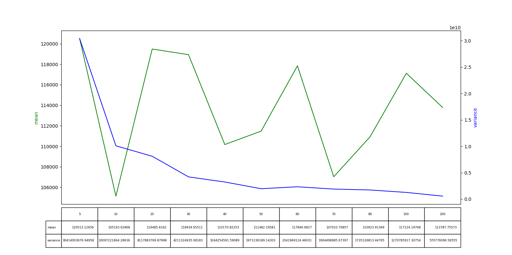

# **Monte Carlo** (MC) methods

## Introduction

> **蒙特卡罗方法**（Monte Carlo method），也称**统计模拟**方法，是1940年代中期由于科学技术的发展和电子计算机的发明，而提出的一种以概率统计理论为指导的数值计算方法。是指使用**随机数**（或更常见的**伪随机数**）来解决很多计算问题的方法。
>
> 通常蒙特卡罗方法可以粗略地分成两类：
>
> 一类是所求解的问题本身具有**内在的随机性**，借助计算机的运算能力可以直接模拟这种随机的过程。
>
> 另一种类型是所求解问题可以**转化为某种随机分布的特征数**，比如随机事件出现的概率，或者随机变量的期望值。通过随机抽样的方法，以随机事件出现的频率估计其概率，或者以抽样的数字特征估算随机变量的数字特征，并将其作为问题的解。这种方法多用于求解复杂的多维积分问题。
>
> 在机器学习中的应用：蒙特卡洛算法也常用于机器学习，特别是强化学习的算法中。一般情况下，针对得到的样本数据集创建相对模糊的模型，通过蒙特卡洛方法**对于模型中的参数进行选取，使之于原始数据的残差尽可能的小**，从而达到创建模型拟合样本的目的

在解决实际问题的时候应用蒙特卡罗方法主要有两部分工作：

用蒙特卡罗方法模拟某一过程时，需要产生各种概率分布的随机变量

统计方法把模型的数字特征估计出来，从而得到实际问题的数值解

### Probability Background

累积分布函数(cumulative distribution function, CDF)：
$$
cdf(x) = Pr\{X \le x\}
$$
与之对应的概率密度函数(probability density function, PDF)：
$$
pdf(x)=\frac{d\space cdf(x)}{dx}
$$
随机变量位于区间内的概率：
$$
Pr\{a\le X \le b\} = \int_{a}^{b}pdf(x)dx
$$
在定义域μ(x)上的随机变量Y = f(x) 的期望：
$$
E[Y]=\int_{\mu(x)}f(x)pdf(x)\space d\mu(x)
$$
方差：
$$
\sigma^2(x)=E[(Y-E(Y))^2]
$$

### The Monte Carlo Estimator

蒙特卡洛积分使用函数的随机抽样来数值计算其积分的估计值。

假设我们要对从a到b的一维函数f(x)进行积分$F = \int_{a}^{b}f(x)dx$，可以通过在区间内的**均匀随机点处**对函数f的样本求平均值来近似该积分，给定N个均匀分布的随机变量$X_{i}\in [a,b)$，其对应的 pdf 为 1/(b-a)，则用于计算F的蒙特卡洛估计量为：
$$
\langle F^N \rangle=(b-a)\frac{1}{N}\sum_{i=0}^{N}f(X_{i})
$$
证明$E|\langle F^N\rangle| = F \space when \space pdf(x) = 1/(b-a)$  
$$
\begin{align}
E[\langle F^N\rangle] &= E[(b-a)\frac{1}{N}\sum_{i=0}^{N-1}f(X_{i})]\\
&=(b-a)\frac{1}{N}\sum_{i=0}^{N-1}E[f(X_{i})]\\
&=(b-a)\frac{1}{N}\sum_{i=0}^{N-1}\int_{a}^{b}f(x)pdf(x)dx\\
&=\frac{1}{N}\sum_{i=0}^{N-1}\int_{a}^{b}f(x)dx\\
&=\int_{a}^{b}f(x)dx\\
&=F
\end{align}
$$
此外，随着我们增加样本数N，估计量$\langle F^N \rangle$变得越来越接近F。根据大数定律，在限制范围内，我们可以保证我们有确切的解：
$$
Pr\{\lim_{N\to\infty}\langle F^N\rangle = F \} = 1
$$
可以将蒙特卡洛积分推广为使用从任意pdf的随机变量并计算多维积分$F=\int_{\mu(x)}f(x)\space d\mu(x)$

可以考虑将均匀分布情况的$\langle F^N\rangle$进行修改$\langle F^N \rangle = \frac{1}{N}\sum_{i=0}^{N-1}\frac{f(X_i)}{pdf(X_i)}$

证明$E|\langle F^N\rangle| = F \space for\space any\space pdf(x)$
$$
\begin{align}
E[\langle F^N\rangle] &= E[\frac{1}{N}\sum_{i=0}^{N-1}\frac{f(X_{i})}{pdf(X_i)}]\\
&=\frac{1}{N}\sum_{i=0}^{N-1}E[\frac{f(X_i)}{pdf(X_i)}]\\
&=\frac{1}{N}\sum_{i=0}^{N-1}\int_{\Omega}\frac{f(x)}{pdf(x)}pdf(x)dx\\
&=\frac{1}{N}\sum_{i=0}^{N-1}\int_{\Omega}f(x)dx\\
&=\int_{\Omega}f(x)dx\\
&=F
\end{align}
$$
采用蒙特卡洛估计**多维积分**的思路（以均匀分布为例）：

更一般而言，在M维中，我们必须在区间$([a_1，b_1],[a_2，b_2],\cdots,[a_M，b_M]）$中随机选择向量，这可以非常容易地生成N个均匀分布的点，则M维函数 f(x) 以下的（M +1）维体积的MC估计为
$$
V^{M+1}\approx V^M \frac{\sum_{i=1}^{N}f(X_i)}{N}
$$

### Variance Reduction

$$
\begin{align}
\sigma^2[\langle F^N \rangle] &= \sigma^2[\frac{1}{N}\sum_{i=0}^{N-1}\frac{f(X_{i})}{pdf(X_i)}]\\
&=\frac{1}{N^2}\sum_{i=0}^{N-1}\sigma^2[\frac{f(X_i)}{pdf(X_i)}]\\
&=\frac{1}{N^2}\sum_{i=0}^{N-1}\sigma^2[Y_i]\\
&=\frac{1}{N}\sigma^2[Y]
\end{align}
$$

所以 
$$
\sigma[\langle F^N \rangle] = \frac{1}{\sqrt N}\sigma[Y]\\
\sigma[\langle F^N \rangle] \propto \frac{1}{\sqrt N}
$$
上述证明中表明，通过增大N，减小每个 $Y_{i}$ 的方差，我们可以减小­$\langle F^N \rangle$ 的整体方差。因此，减少方差的技术都是试图使每个$Y_{i}$尽可能恒定，以减少估计量的整体误差，e.g. Importance Sampling 

## Exercise

### Monte Carlo simulation approximating pi

> The Monte Carlo method can be used to generate an approximate value of pi. The figure below shows a unit square with a quarter of a circle inscribed. The area of the square is 1 and the area of the quarter circle is pi/4. Write a script to generate random points that are distributed uniformly in the unit square. The ratio between the number of points that fall inside the circle (red points) and the total number of points thrown (red and green points) gives an approximation to the value of pi/4. This process is a Monte Carlo simulation approximating pi. Let N be the total number of points thrown. When N=50, 100, 200, 300, 500, 1000, 5000, what are the estimated pi values, respectively? For each N, repeat the throwing process 100 times, and report the mean and variance. Record the means and the corresponding variances in a table.

过程：

1. 生成**均匀分布**的N个点(x,y)，$x,y\in[0,1)$
2. 计算出其中 x^2 + y^2 <=1 的点的比例 * 4 就是估算的pi值

### integrate a function by Monte Carlo method

> We are now trying to integrate the another function by Monte Carlo method:$\int_{x=0}^{1}x^3$
>
> A simple analytic solution exists here: $\int_{x=0}^{1}x^3= 1/4$. If you compute this integration using Monte Carlo method, what distribution do you use to sample x? How good do you get when N = 5, 10, 20, 30, 40, 50, 60, 70, 80, 100, respectively? For each N, repeat the Monte Carlo process 100 times, and report the mean and variance of the integrate in a table.

过程：

1. 生成**均匀分布**的N个x，$x\in[0,1)$
2. 计算出N个x对应的f(x)的平均值，再除于$pdf(x) = 1/(1 - 0) = 1$，就是估计的积分值

以下是两次测试：

### integrate a more difficult function

> We are now trying to integrate a more difficult function by Monte Carlo method that may not be analytically computed:
> $$
> \int_{x=2}^{4}\int_{y=-1}^{1}f(x,y)=\frac{y^2*e^{-y^2}+x^4*e^{-x^2}}{x*e^{-x^2}}
> $$
> Can you compute the above integration analytically? If you compute this integration using Monte Carlo method, what distribution do you use to sample (x,y)? How good do you get when the sample sizes are N = 5, 10, 20, 30, 40, 50, 60, 70, 80, 100, 200 respectively? For each N, repeat the Monte Carlo process 100 times, and report the mean and variance of the integrate.

过程：

1. 生成**均匀分布**的N个点 (x, y) ，$x\in[2,4)\space and \space y\in [-1,1)$
2. 计算出N个点对应的f(x)的平均值，再除于$pdf(x) = 1/(|4-2|*|1-(-1)|) = 1/4$，就是估计的积分值

以下是两次测试：

