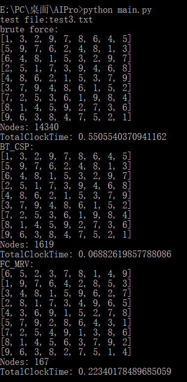

# Alpha Beta Pruning and Sudoku Solver 

[TOC]

## Alpha Beta Pruning

### Minimax Algorithm

> Minimax是一种决策算法（一种递归或回溯算法），通常用于基于回合的两人游戏。 该算法的目标是找到最佳的下一步。
>
> 在该算法中，一个参与者称为最大化器Maximizer，另一参与者称为最小化器Minimizer。 如果我们将评估分数分配给游戏板，则一个玩家尝试选择得分最高的游戏状态（获得最高分），而另一名玩家选择得分最小的状态（获得最低分）。
>
> 它基于零和博弈的概念。 在零和游戏中，总效用得分在玩家之间分配。 一个玩家得分的增加导致另一玩家得分的减少。 因此，总分始终为零。 一个玩家要赢，另一人就必须输。 此类游戏的示例是国际象棋，扑克，跳棋，井字游戏。

一般解决博弈类问题的自然想法是**将格局组织成一棵树，树的每一个节点表示一种格局**，而父子关系表示由父格局经过一步可以到达子格局。它通过对以当前格局为根的格局树搜索来确定下一步的选择，而一切格局树搜索算法的核心都是对每个格局价值的评价。**Minimax算法执行深度优先搜索算法来探索完整的游戏树，一直向下进行到树的终端节点，然后作为递归回溯树。**

Maximizer从根节点开始，然后选择得分最高的移动。 不幸的是，只有叶子具有评估分数，因此该算法必须**递归到达叶子节点**。 在给定的游戏树中，当前轮到Minimizer从叶节点中选择一个动作，因此得分最小的节点（这里是节点3和4）将被选中。 它会类似地不断选择最佳节点，直到到达根节点为止。


- 算法的步骤总结：
  1. 构造完整的游戏树
  2. 使用评估功能评估叶子的分数
  3. 自底向上从叶子到根计算分数，根据玩家类型选择：
     - 对于maximizer，选择得分最高的孩子
     - 对于minimizer ，选择得分最低的孩子
  4. 在根节点上，选择具有最大值的节点并执行相应的移动

- 局限

  Minimax算法的主要缺点是，对于复杂的游戏（如国际象棋，围棋等），它的运行速度会非常慢。这种类型的游戏具有很大的分支因子，并且玩家可以选择很多选择。 Minimax算法的这一局限性可以通过我们在下一个主题中讨论的alpha-beta修剪得到改善。

- 伪代码

  ```pseudocode
  Function:(move)minimax(state,turn)
  Input:	State of the game, Whose turn it is
  Output: the best move that can be played by the player given in the input.
  
  if game is in terminal state then
  	return static score of node
  	
  if turn == Maximizer then
  	maxScore= -infinity            
   	for each child of node do
      	curState= move to this child
   		curScore= minimax(curState,Minimizer)  
  		maxScore= max(maxScore,curScore)        //gives Maximum of the values  
  	return maxScore
  else
  	minScore= infinity            
   	for each child of node do
      	curState= move to this child
   		curScore= minimax(curState,Maximizer)  
  		minScore= min(maxScore,curScore)        //gives Minimum of the values  
  	return minScore
  ```

### Minimax with Alpha Beta Pruning

> Alpha-Beta剪枝用于裁剪搜索树中没有意义的不需要搜索的树枝，以提高运算速度。即Alpha-beta修剪是Minimax算法的修改版本，它是Minimax算法的一种优化技术。

正如我们在**Minimax搜索算法**中看到的那样，它必须检查的游戏状态数量**在树的深度上呈指数级**。由于我们无法消除指数，因此可以将其减半。因此，存在一种**无需检查游戏树的每个节点**就可以计算正确的minimax决策的技术，该技术称为修剪。

Alpha-beta修剪的名称来自计算过程中传递的两个边界，这些边界基于已经看到的搜索树部分来限制可能的解决方案集。特别的，

α 	Alpha is the *maximum lower bound* of possible solutions 

到目前为止，我们在Maximizer路径上的任何时候都发现了**最佳（最高价值）选择**。 alpha的**初始值为-∞**

β	 Beta is the *minimum upper bound* of possible solutions

到目前为止，我们已经在Minimizer的任何位置找到了**最佳（最低价值）选择**。 beta的**初始值为+∞**。

- 算法原理

  Alpha-beta修剪会**返回与标准Minimax算法相同的动作**，但是会**删除**所有**不会真正影响最终决策**但会使算法变慢**的节点**。 因此，通过修剪这些节点，可以使算法更快。

  因此，当任何新节点被视为解决方案的可能路径时，它仅在以下情况下可以工作：
  $$
  \alpha <= N <= \beta
  $$
  否则，就需要**进行剪枝**

  并且保证：

  - **Maximizer** 只会更新 **Alpha** 的值， **Minimizer**只会更新 **Beta** 的值
  - 在**回溯树**时，**节点值将传递**到较高的节点，而不是alpha和beta值。我们只会**将alpha，beta值传递给子节点**。

  

- 伪代码

  ```pseudocode
  Function:(move)minimax(state, turn, alpha, beta)
  Input:	State of the game, Whose turn it is, Alpha, Beta
  Output: the best move that can be played by the player given in the input.
  
  if game is in terminal state then
  	return static score of node
  	
  if turn == Maximizer then
  	maxScore= -infinity            
   	for each child of node do
      	curState= move to this child
   		curScore= minimax(curState,Minimizer,alpha,beta)  
  		maxScore= max(maxScore,curScore)        //gives Maximum of the values
          alpha= max(alpha,maxScore)				//Update alpha
          if beta <= alpha then
          	break
  	return maxScore
  else
  	minScore= infinity            
   	for each child of node do
      	curState= move to this child
   		curScore= minimax(curState,Maximizer)  
  		minScore= min(maxScore,curScore)        //gives Minimum of the values  
  		beta= min(beta,minScore)				//Update beta
          if beta <= alpha then
          	break
  	return minScore
  ```

### 课后作业1

详细代码请参照附件

题目：


代码运行结果：


根据以上算法思想所得结果：


经比较，一致

## Sudoku Solver

### 数独

> 数独是一种运用纸、笔进行演算的[逻辑游戏](https://baike.baidu.com/item/逻辑游戏/12814189)。玩家需要根据9×9盘面上的已知数字，推理出所有剩余空格的数字，并满足每一行、每一列、每一个粗线宫（3*3）内的数字均含1-9，不重复。
>
> 数独盘面是个九宫，每一宫又分为九个小格。在这八十一格中给出一定的已知数字和解题条件，利用逻辑和推理，在其他的空格上填入1-9的数字。使1-9每个数字在每一行、每一列和每一宫中都只出现一次，所以又称“九宫格”。


对于数独，还有一个性质：

有许多具有17条线索的九宫示例具有独特的解决方案，但我们从未发现只有16条线索的位置良好的九宫。 这表明九宫中提供的线索的最小数量为17。事实是如果**用少于17个正方形填充或少于8个不同的数字**，就会知道有**重复**的解决方案。

### Brute Force

> 在计算机科学中，蛮力搜索或穷举搜索（也称为生成和测试）是一种非常通用的解决问题的技术，包括系统地枚举所有可能的解决方案候选者并检查每个候选者是否满足问题陈述。该方法不包含任何捷径来提高性能，而是依靠纯粹的计算能力来尝试所有可能性，直到找到问题的解决方案为止。

我们知道对于广义n*n拼图情况是NP完全问题，一般是需要更优雅的方法来解决——某种启发式算法，但是我们在这里也尝试一下使用BF算法来解决。

解决数独的BF方法就好像一支铅笔（搜索填充，穷举）和一个大橡皮（回溯）。 用数字值一次填充一个正方形，然后继续操作，直到行，列或3*3正方形之一包含重复值。

- 伪代码

```pseudocode
Function BFSolver(sudoku)
Input: The sudoku to be solved
Output: The solution

try:
	i = sudoku.index(0) 	//to find the first cell to fill
except ValueError:
	return sudoku			//No empty cell left -> find the solution
	
for v in range(1, 10):
	new_sudoku = fill v into sudoku[i]
	if satisfied(new_sudoku,i)
		continue
	r = BFSolver(new_sudoku)
	if r is not None then 
		return r

Function satisfied(suduku,index)
 	row_element = The line where index is located
 	col_element = The column where index is located
	box_element = The box where index is located
	return len(row_element)==len(set(row_element)) and len(col_element)==len(set(col_element)) and len(box_element)==len(set(box_element))
```

代码在附件中给出


所有AI算法中普遍存在的一个方面是“搜索”。组合优化算法有多种：Constraint Satisfaction Problem(CSP) / Satisfiablility Problem(SAT) / Constraint Programming(CP)，这里我们接着来介绍CSP

### Back-Tracking --- CSP

> **约束满足问题（CSP）**是数学问题，定义为状态必须满足许多约束或限制的一组对象。 CSP将问题中的实体表示为对变量的有限约束的同质集合，这可以通过约束满足方法来解决。
>
> **约束满足问题**(CSP-Constraint Satisfaction Problem)是人工智能研究领域的一个重要分支,现实生活中的很多问题,都可以用**约束满足问题**来建模。**约束满足问题**通常都是NP-hard问题

在本例中，CSP可以分为以下几个部分

- Variables

  每个空单元格(在list中表现为0)都是一个变量。

- Domain

  每个变量可以使用1到9个数字之一，这是变量的域。

  值的一种可能组合称为“world”。 因此有（d ^ n）个worlds。 d是域的大小，n是变量的数量。

- Constraint

   每个变量都必须满足一些约束。 在数独的情况下，存在三个这样的约束。

  - 每一行的数字均不重复
  - 每一列的数字均不重复
  - 每一粗线宫的数字均不重复

- Model

  Model是满足所有Constraints的World

CSP用于搜索的主要算法是**回溯**。 通过以特定顺序**从域中获取值**，通过顺序实例化变量来使用**深度优先搜索**（DFS）探索搜索空间。 在每次分配时，都会**检查约束**的所有变量是否都绑定。 一旦将所有变量绑定到约束，就将对其进行评估。 如果约束失败，则**修剪**该树。 修剪会减少搜索空间。

在本例中，我们还可以通过更改**选择变量**的方法来改善回溯。

- 选择一个有着最大约束的变量
- 选择一个有着最小域的变量

在数独方面，只有“最小剩余价值”才有意义（由于下一个算法会考虑这个问题，这一步暂时不考虑）。 通过**选择值数量较少的粗线宫**，可以减少分支。 对于每种算法，通过应用针对该问题的启发式方法都有改进。

- 约束传播

  > 当一个变量说Y的约束取决于X时。当更改或分配了变量X时，需要重新计算变量Y。 反过来，这将重新计算约束依赖于Y的所有变量。此过程将递归进行，直到没有更多更改为止。 这称为约束传播。

  当我们放置了一个cell之后，它所在的行/列/粗线宫的其他空白cell的约束条件都会发生变化，此时就需要重新计算约束，每次重新计算变量时，该变量的域都会减少。 缩小的域意味着更少的搜索。

- CSP问题的基本框架

  ```python
  def backtrack(assignment, csp):
    if assignment is complete: return assignment
    var = select-unassigned-variable(csp)
    for each value in order-domain-values(var, assignment, csp):
      if value is consistent with assignment:
        set var = value in assignment
        inferences = inference(csp, var, value)
        if inferences do not fail:
          add inferences to assignment
          result = backtrack(assignment, csp)
          if result is not failure:
            return result
      remove var = value and inferences from assignment
    return failure
  ```

- 伪代码

  ```python
  Function BTCSP(sudoku)
  Input: The sudoku to be solved
  Output: The solution
  
  try:
  	i = sudoku.index(0) 	//to find the first cell to fill
  except ValueError:
  	return sudoku			//No empty cell left -> find the solution
  	
  c = the cell that is in the same 3*3 block, in the same column and row as i
  
  for v in range(1, 10):
  	if v not in c:
  		r = BTCSP(fill v into sudoku[i])
  		if r is not None then 
  			return r
  ```
  
  

### Forward - checking with MRV heuristics

> 前向检查(forward checking)是回溯搜索中使用的一种筛选，对于早期检测不可避免的故障很有用。前向检查仅是约束传播的简单形式。
>
> ```pseudocode
> When a pair (X <- v) is added to assignment A do:
> 	For each variable Y not in A do:
> 		For every constraint C relating Y to variables in A do:
> 			Remove all values from Y’s domain that do not satisfy C 
> ```

> 最小剩余值(Minimum Remaining Values，MRV)是增加回溯搜索的排序策略。 它建议我们选择变量域中剩余值最少的变量，然后再分配。

回溯搜索的第一个改进是向前检查（其实这一步在约束条件中已有体现）。

- 需要维护一份清单，每个粗线宫会给出已分配的其他数字。在将值分配给该粗线宫时，仅考虑那些不与其他已经放置的数字直接冲突的值。

改进回溯搜索的另一种方法是最小剩余值启发式。

- 最小剩余值启发式方法用于更改猜测放置cell的顺序，以减少每个级别上的分支数量。基本上，不选择第一个空cell，而是选择可能值最少的cell。因此我们需要迭代了九宫图的blank cell，并检查了哪些可分配值最少的cell。

  

- 伪代码

  ```python
  Function FCMRV(sudoku)
  Input: The sudoku to be solved
  Output: The solution
  
  try:
  	i = sudoku.get_mrv_index(sudoku) 	//to find the first cell to fill
  except ValueError:
  	return sudoku			//No empty cell left -> find the solution
  	
  c = the cell that is in the same 3*3 block, in the same column and row as i
  
  for v in range(1, 10):
  	if v not in c:
  		r = FCMRV(fill v into sudoku[i])
  		if r is not None then 
  			return r
  
  Function get_mrv_index(sudoku)
  	store_blank_mrv = []
          cores_index = []
          
          for i in range(81):
              if sudoku[i] == 0:
                  mrv_value =  10 - The number of elements in the blank peer with the same box or the same column or the same row
                  
                  store_blank_mrv.append(mrv_value)
                  cores_index.append(i)
                  
          return cores_index[store_blank_mrv.index(min(store_blank_mrv))]
  ```

  

### 结果分析

1. 我们先来演示找到一个解决方案的时间

   |            case1             |            case2             |
   | :--------------------------: | :--------------------------: |
   |  |  |
   |          **case 3**          |          **case 4**          |
   |  |  |
   |          **case 5**          |                              |
   |  |                              |

   可以看到，几种方法的对比：

   nodes：BruteForce > BT_CSP > FC_MRV

   TotalClockTime：BruteForce > FC_MRV > BT_CSP

   也就是说，BT_CSP在 深度搜索+回溯 比 FC_MRV在 根据MRV搜索+回溯的时间 更短，因为每次MRV搜索都相当于把整个图遍历好几次，这是相当耗费时间的，但是好处就是我们需要搜索的次数相比来说要少，但总体来说，在生成一个答案的题目下，效果是

   BT_CSP > FC_MRV > BruteFoce

   | case 1                           | case 2                           |
   | -------------------------------- | -------------------------------- |
   |  |  |
   | **case 3**                       |                                  |
   |  |                                  |

   由于case 4 和 case 5 所需的时间实在是太长，所以我们这里不做测试

   可以看到，大体上与寻找一个答案所需的nodes和totalclocktime的排名几乎没有什么变化

   基本上FC_MRV就是**利用**判断搜索位置的**时间换取**深度搜索的**空间**

   但是，随着数独所给出的条件越少，搜索空间越大，FC_MRV所要确定需要填充的位置的时间就越久，所起到的优化作用相比于BT_CSP越来愈少。