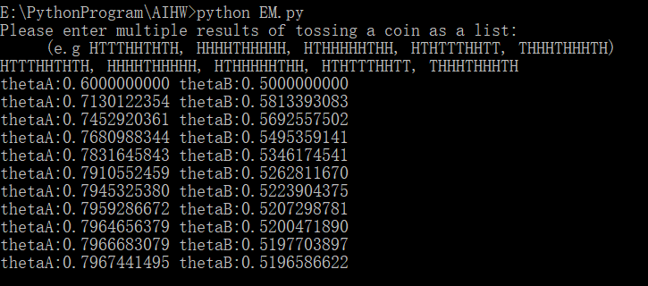
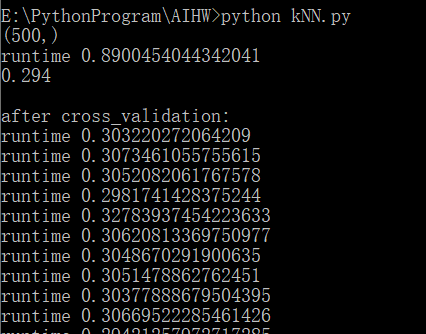
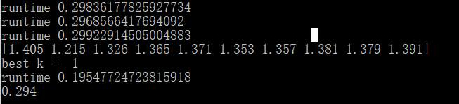
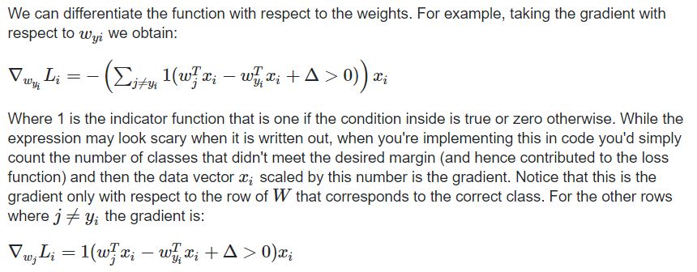
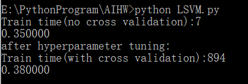
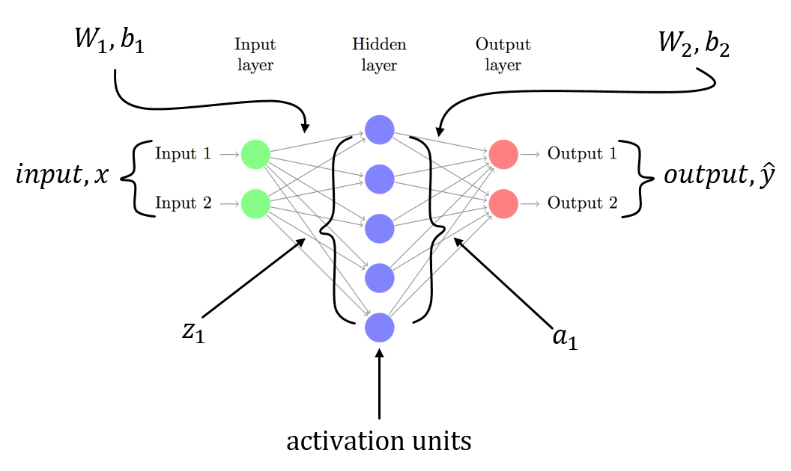
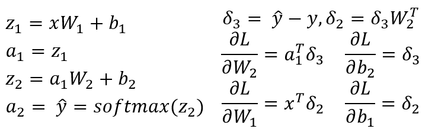
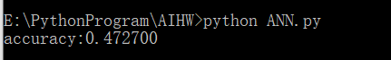

# Expectation-Maximization Algorithm and Image Classifier  

[toc]

==数据集路径请自行在cifar.py中定义==

## Expectation-Maximization Algorithm

### Introduction

> EM算法也称期望最大化（Expectation-Maximum,简称EM）算法，它是一个基础算法，是很多机器学习领域算法的基础，比如隐式马尔科夫算法（HMM）， LDA主题模型的变分推断等等。 

### Main problem solved

我们经常会从样本观察数据中，找出样本的模型参数。 最常用的方法就是==极大化模型分布的对数似然函数==。 但是在一些情况下，我们得到的观察数据有未观察到的隐含数据，此时我们==未知的有隐含数据和模型参数==，因而无法直接用极大化对数似然函数得到模型分布的参数。 

EM算法解决这个的思路是使用启发式的迭代方法，既然我们无法直接求出模型分布参数，那么我们可以先==猜想隐含数据==（EM算法的**E步**），接着基于观察数据和猜测的隐含数据一起来极大化对数似然，求解我们的模型参数（EM算法的**M步**)。由于我们之前的隐藏数据是猜测的，所以此时得到的模型参数一般还不是我们想要的结果。不过没关系，我们基于当前得到的模型参数，继续猜测隐含数据（EM算法的E步），然后继续极大化对数似然，求解我们的模型参数（EM算法的M步)。以此类推，不断的==迭代==下去，直到模型分布参数基本无变化，算法==收敛==，找到合适的模型参数。 

### Flow

输入：观察数据 $x=(x(1),x(2), \cdots x(m))$，联合分布$p(x,z|\theta)$，条件分布$p(z|x,\theta)$，最大迭代次数J

1. 随机初始化模型参数θ的初始值θ<sup>0</sup>

2. From 1 to J 开始迭代：

   - Step E：计算联合分布的条件概率期望：
     $$
     Q_{i}(z(i)) = P(z(i)|x(i),\theta^{j}) \\
     L(\theta,\theta^{j})=\sum_{i=1}^{m}\sum_{z(i)}Q_{i}(z(i))logP(x(i),z(i)|\theta)
     $$

   - Step M：极大化$L(\theta,\theta^{j})$，得到$\theta^{j+1}$
     $$
     \theta^{j+1} = \arg\max_{\theta}L(\theta,\theta^{j})
     $$

   - 如果$\theta^{j+1}$一收敛，则算法结束。否则进行Step E迭代

至于收敛性的保证以及能否收敛到全局最大值的问题就比较复杂了……

### EM vs MLE

- 共同点：

  都可以找到“最佳拟合”参数

- 不同点：

  MLE首先累积所有数据，然后使用该数据构建最可能的模型。 

  EM首先对参数进行猜测（考虑丢失的数据），然后对模型进行调整以适合猜测和观察到的数据。

### Limitations

即使在最快的计算机上，EM算法也会非常慢。 当丢失的数据只占==很小的百分比并且数据的维数不太大==时，这种方法最有效。 维度越高，E-Step越慢； 对于具有较大维数的数据，随着过程接近局部最大值，您可能会发现E-Step的运行速度非常慢。

### Homework —— Coin Flips

> 假设有两枚硬币 A、B，以相同的概率随机选择一个硬币，进行如下的抛硬币 实验：共做 5 次实验，每次实验独立的抛十次，结果如图中 a 所示，例如某次实验 产生了 H、T、T、T、H、H、T、H、T、H，H 代表正面朝上。 
>
> a 表示实习生记录了详细的试验数据，我们可以观测到试验数据中每次选择的 是 A 还是 B 
>
> b 表示实习生忘了记录每次试验选择的是 A 还是 B，我们无法观测实验数据中选择的硬币是哪个 
>
> 问：在两种情况下分别如何估计两个硬币正面出现的概率？并完成相应的 python 代码实现。 

我们可以从对硬币偏差的猜测开始，这将使我们能够估计每次试验中选择了哪种硬币，并对每个硬币的预期正面和反面数目进行估算。 先使用E-Step， 然后，我们使用这些计数来重新计算每个硬币偏差的更好猜测M-Step。 通过重复这两个步骤，我们继续对这两个硬币偏差进行更好的估计，并收敛于一个解决方案，该解决方案最终成为问题的局部最大值。

假设每组硬币投掷事件为E，选择A或选择B分别为$Z_{A}$和$Z_{B}$

#### Step E

首先根据伯努利分布计算出
$$
P(E|Z_{A})=P(HHHHHHHHTT|A\ chosen) \\
P(E|Z_{B})=P(HHHHHHHHTT|B\ chosen)
$$
根据贝叶斯理论和全概率公式
$$
P(Z_{A}|E)=\frac{P(E|Z_{A})P(Z_{A})}{P(E|Z_{A})P(Z_{A})+P(E|Z_{B})P(Z_{B})}=\frac{P(E|Z_{A})}{P(E|Z_{A})+P(E|Z_{B})}\\
=\frac{\theta_{A}^{h}(1-\theta_{A})^t}{\theta_{A}(1-\theta_{A})^{t}+\theta_{B}^{h}(1-\theta_{B})^{t}}
$$
$P(Z_{B}|E)$同理

然后根据算出来的P为每个硬币分配预期的翻转次数

根据作业图中所给的$\theta_{a}^{0}=0.6$ $\theta_{b}^{0}=0.4$

| flips      | probability A | probability B | heads attributed to A | heads attributed to B |
| :--------- | :------------ | :------------ | :-------------------- | :-------------------- |
| HTTTHHTHTH | 0.45          | 0.55          | 2.2                   | 2.8                   |
| HHHHTHHHHH | 0.8           | 0.2           | 7.2                   | 1.8                   |
| HTHHHHHTHH | 0.73          | 0.27          | 5.9                   | 2.1                   |
| HTHTTTHHTT | 0.35          | 0.65          | 1.4                   | 2.6                   |
| THHHTHHHTH | 0.65          | 0.35          | 4.5                   | 2.5                   |

#### Step M

> 改善对硬币偏差的估算 

 对于每个硬币，我们将期望的正面数除以总翻转数，即知道每次选择的哪种硬币。 
$$
\theta_{a}^{i+1} = \frac{heads\ attributed\ to\ A}{\sum{probility\ A}}
$$
总结起来：

Step-E就是根据假设存在硬币偏差，为我们看到的试验计算每个硬币预期的正面和反面数量 

Step-M就是通过简单地将每个硬币的正面数除以总翻转数反过来提供对硬币偏差的猜测 

###  Pseudocode 

```pseudocode
func EM:
	thetaA = given or random
	thetaB = given or random 
	for i in range(iteration):
		step_e
		step_m
	
func step_e:
	calculate P(ZA_E) according to each coin event
	calculate P(ZB_E) according to each coin event
	calculate expected_head_for_A,expected_tail_for_A
	calculate expected_head_for_B,expected_tail_for_B

func step_m:
	theta_a = expected_head_for_A/(expected_head_for_A+expected_tail_for_A)
	theta_b = expected_head_for_B/(expected_head_for_B+expected_tail_for_B)
```

### Result



## Image Classifier

> 参考文档：
>
> [SVM](http://www.cs.haifa.ac.il/~rita/ml_course/lectures/Multiclass%20Classification.pdf)

### KNN

#### Introduction

> K最近邻（k-Nearest Neighbor，KNN）分类算法采用测量不同特征值之间的距离方法进行分类。如果一个样本在特征空间中的k个最相似（即特征空间中最邻近）的样本中的大多数属于某一个类别，则该样本也属于这个类别。 

#### Flow

1.  计算已知类别数据集中的点与当前点之间的距离
2.  按照距离递增次序排序 
3.  选取与当前点距离最小的k个点 
4.  确定前k个点所在类别的出现频率 
5.  返回前k个点出现频率最高的类别作为当前点的预测分类 

#### Pseudocode 

```pseudocode
input:test_set
func compute_distance:
	Calculate the distance between each sample in the test set 
	and the known training set through matrix multiplication

func predict:
	select k points
	calculate the frequency of occurrence of each of these classes
	return the most frequently occurring class 
```

#### K-Fold Cross-Validation

> 交叉验证是在机器学习建立模型和验证模型参数时常用的办法。交叉验证，顾名思义，就是重复的使用数据，把得到的样本数据进行切分，组合为不同的训练集和测试集，用训练集来训练模型，用测试集来评估模型预测的好坏。在此基础上可以得到多组不同的训练集和测试集，某次训练集中的某样本在下次可能成为测试集中的样本，即所谓“交叉”。

k折交叉验证会把样本数据随机的分成K份，每次随机的选择k-1份作为训练集，剩下的1份做测试集。当这一轮完成后，重新随机选择K-1份来训练数据。若干轮（小于K）之后，选择损失函数评估最优的模型和参数。 

通过交叉验证进行超参数调整，比如这里的k，我们无法确定最优，但是我们可以通过训练集选出训练集最好的k

#### Result

> 由于完整数据过于耗时，采用随机抽取的方法进行测试





### SVM

线性分类主要关注评分函数的概念以及如何将其用于将输入数据映射到类标签。但是，为了实际“学习”从输入数据到类标签的映射，其中有两个重要的概念：

- loss function
- optimization methods

而在损失函数中我们经常会看到的就是

> 在最基本的层次上，损失函数仅用于量化给定预测变量对数据集中输入数据点进行分类的“好”或“坏”程度。 损失越小，我们的分类器在建模输入数据和输出类别标签之间的关系方面的工作就越好。

- MSE loss

- Multi-class SVM loss
- Cross-entropy (used for Softmax classifiers/Multinomial Logistic Regression)

#### Introduction

> 在机器学习中，支持向量机是带有相关学习算法的监督学习模型，该算法分析用于分类和回归分析的数据。给定一组训练示例，每个训练示例都标记为属于两个类别中的一个或另一个，则SVM训练算法将构建一个模型，该模型将新示例分配给一个类别或另一个类别，使其成为非概率二进制线性分类器。SVM模型是将示例表示为空间中的点，并进行了映射，以使各个类别的示例被尽可能宽的明显间隙分开。然后，将新示例映射到相同的空间，并根据它们落入的间隙的侧面来预测属于一个类别。 

然后还是一直的方法：计算得分函数 -> 计算损失函数 -> 优化（ 相对于得分函数的参数最小化损失函数） 

#### Multiclass SVM Loss

每个输入的正确类别的分数应比不正确类别的分数高出一定的固定幅度∆。

假设第j个类的得分函数为
$$
s_{j} = f(x_{i},\theta)
$$
对于第i个样本
$$
L_{i}=\sum_{j!=y_{i}}max(0,s_{j}-s_{y_{i}}+\Delta)
$$
用向量来表示：
$$
\theta \triangleq W \qquad s_{j}=f(x_i,W)_{j} \\
f(x_{i},W)=Wx_{i}\\
W=\begin{bmatrix}w_{1}\\ \cdots \\ w_{c} \end{bmatrix} \quad 
w_{j} \triangleq \begin{bmatrix}w_{j} \\ b_{j} \end{bmatrix} \quad 
x \triangleq\begin{bmatrix}x\\1\end{bmatrix}\\
L_{i} = \sum_{j\neq y_{i}}max(0,w_{j}^{T}x_{i}-w_{y_{i}}^{T}x_{i}+\Delta)
$$
Hinge loss：$max(0,-)$

- 正则化

  > 上面介绍的损失函数存在一个错误。假设我们有一个数据集和一组参数W可以对每个示例进行正确分类（即所有分数均满足所有边距，并且所有的 i 满足$L_{i}=0$）。
  >
  > 问题是这组W不一定是唯一的：可能有许多相似的W可以正确地对示例进行分类。 
  >
  > 如果某些参数W正确地分类了所有示例（因此每个示例的损失为零），则这些参数λW的任何倍数（其中λ>1也会产生零损失），因为此变换均匀地拉伸了所有得分幅度，以及它们的绝对差异。 

  也就是说，我们希望对权重W的某些优先级进行编码，以消除这种歧义。我们可以通过用正则化罚分R(W)（扩展损失函数）来做到这一点。最常见的正则化惩罚是L2范式，它通过对所有参数进行逐元素二次惩罚来阻止较大的权重： 
  $$
  R(W)=\sum_{k}\sum_{l}W_{k,l}^{2}
  $$
  在上面的表达式中，我们总结了W的所有平方元素。注意，正则化函数不是数据的函数，它仅基于权重。

  包括正则化惩罚可以完成完整的多类支持向量机损失，该损失由两个部分组成：数据损失（这是所有示例中的平均损失$L_{i} $）和正则化损失。也就是说，完整的多类SVM损失变为： 
  $$
  L = \frac{1}{N}\sum_{i}L_{i}+\lambda R(W)
  $$

总结起来：
$$
L = \frac{1}{N}\sum_{i}\sum_{i \neq y_{i}}[max(0,f(x_{i};W)_{j}-f(x_{i};W)_{y_{i}}+\Delta)] + \lambda\sum_{k}\sum_{l}W_{k,l}^{2}
$$

- N是训练样本的数量
- λ是正则化强度参数（通常由交叉验证获取）

> 事实证明，可以在所有情况下将此超参数安全地设置为Δ=1.0。超参数Δ和λ看起来像两个不同的超参数，但实际上它们都控制相同的权衡：数据损失与目标中的正则化损失之间的权衡。
>
> 理解这一点的关键是权重W的大小直接影响得分（以及它们之间的差异）：
>
> 当我们缩小W内的所有值时，得分差异将变小，并且随着权重的增加，得分也随之提高差异将变得更高。
>
> 因此，分数之间的余量的精确值（例如，Δ＝1或Δ＝100）在某种意义上是无意义的。
>
> 因为权重可以任意地缩小或拉伸差异。因此，唯一的权衡是我们允许权重增长（通过正则化强度λ）。

最后就是最小化损失函数，这里我们使用随机梯度下降（样本量较多，更快）

至于梯度的计算，这里我就直接贴上网上的图



#### Pseudocode 

```pseudocode
func calc_loss_and_gradient:
	1.Calculate the score function for each class
	2.Record the score of the example's correct class
	3.Compute for the margin by getting the max between 0 and the computed expression
	4.Add all the losses and divide it all over the number of training examples
	5.Regularize
	//calculate gradient
	6.flag the examples which their margin is greater than 0
	7.count the number of these examples where margin > 0
	8.according to the above formula, the matrix is multiplied to get the gradient
	9.regularize

//Stochastic Gradient Descent
func sgd:
	for i in range(iteration_num):
		W -= learning_rate * gradient
		
func predict:
	multiply the test sample by W to get the scores relative to each class
	return the highest-scoring class
```

同样地，我们这里也使用交叉验证调整超参数 梯度下降学习率 α 和 正则化强度 λ

除此之外，还使用了 **Mean subtraction** 对输入数据进行处理

它涉及减去数据中每个单独特征的均值，并且具有将数据云围绕每个维度围绕原点居中的几何解释。特别是对于图像，为方便起见，通常会从所有像素中减去一个值（例如X -= np.mean（X）），或者在三个颜色通道中分别这样做。 

#### Result

同样这里为了节省超参数调整的时间，选取了部分样本测试



### Two-layer fully-connected neural network

由于对神经网络不太熟悉，这一段就粗略写过了……

> 神经网络作为图中的神经元。神经网络被建模为在无环图中连接的神经元的集合。换句话说，某些神经元的输出可以成为其他神经元的输入。不允许使用循环，因为这将意味着网络的正向传递中存在无限循环。神经网络模型通常被组织成不同的神经元层，而不是连接的神经元的无定形斑点。对于常规的神经网络，最常见的层类型是完全连接的层，其中两个相邻层之间的神经元完全成对连接，但是单层内的神经元不共享任何连接。 


> 当我们说N层神经网络时，不计算输入层。 

之前我们介绍过Multiclass SVM loss，现在我们介绍这里用到的另一种损失函数（Softmax分类器所用的交叉熵损失）
$$
L_{i}=-log(\frac{e^{f_{y_{i}}}}{\sum_{j}e^{f_{j}}})
$$

- ReLU 整流线性单元

   激活函数， 当x <0时为零，然后在x> 0时线性为斜率1 

  

  

  好处：

  - ReLU可以通过简单地将激活矩阵阈值设为零来实现。 
  - 相比于其他激活函数，使用随机梯度下降的收敛速度更快

其他其实与SVM很相似

通过forward pass计算得分和损失函数

> 重复的矩阵乘法与激活函数交织在一起。 因为我们正在实现完全连接的层，所以前向传递只是简单的点矩阵运算。然后，我们分别计算隐藏层和输出层的预激活值z1和z2，以及第一层的激活值。scores变量保留输出层的预激活值。我们将在一段时间内使用它来找到输出层中的激活值，从而找到交叉熵损失。 

然后通过backpropagation计算梯度

> 在后向传递的过程中我们计算权重和偏差的导数，并将其在网络中传播。这样，网络就可以感觉到每个单独单元的作用，并据此进行调整，以使权重和偏差达到最佳。 





#### Pseudocode

> 其实和svm差不多，就是多了forward pass和backpropagation

```pseudocode
func calc_loss_and_gradient:
	//forward pass
	1.scores for first layer pre-activation
	2.scores for first layer activation (ReLU)
	3.scores for second layer pre-activation
	2.scores for second layer activation (Softmax)
	3.Compute cross-entropy loss
	
	//backpropagation
	6.Calculate gradient backpropagation according to the formula above

//Stochastic Gradient Descent
func sgd:
	for i in range(iteration_num):
		W -= learning_rate * gradient
		
func predict:
	1.multiply the test sample by activation function and 
	  pre-active layer to get the scores relative to each class
	return the highest-scoring class
```

#### Result

这里没有使用交叉验证调整参数，所以我们使用完整的样本



## 代码运行方法

==数据集路径请自行在cifar.py中定义==

对于所有代码，全部都写上main函数，只需要直接运行即可