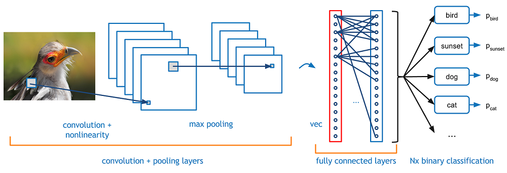
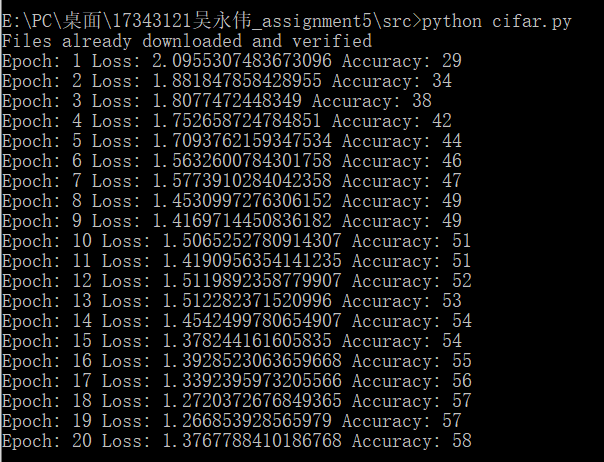

# CNN 设计与实现

[toc]

## Introduction to CNN

Convolutional Neural Networks (CNNs / ConvNets)

> CNN是最为成功的深度神经网络(DNN)特例之一。CNN广泛的应用于图像识别，现在也应用于NLP等其他领域。

卷积神经网络与我们在Assignment 4 中实现的普通神经网络非常相似：它们由具有可学习的权重和偏差的神经元组成。每个神经元接收一些输入，执行点积，并可选地以非线性跟随。整个网络仍然表示一个单一的可微分的分数函数：从一端的原始图像像素到另一端的类的score函数，仍然有一个损失函数(如支持向量机/Softmax)在最后的(全连接)层，并且我们为学习常规神经网络而开发的所有提示/技巧仍然适用。

CNNs 可以看成由两个主要部分组成：

- 卷积层/池化层将图像分解为特征并对其进行分析
- 全连接层获取上一部分的输出并预测描述图像的最佳标签



### Compared to Regular Neural Nets

> 该部分引用自[cs231n](http://cs231n.github.io/convolutional-networks/)

1. 常规神经网络无法很好地缩放为完整图像。

   > 在CIFAR-10中，图像的大小仅为32x32x3（32个宽，32个高，3个颜色通道），因此常规神经网络的第一个隐藏层中的单个完全连接的神经元的权重为32 * 32 * 3 = 3072。这个数量似乎仍然可以控制，但是很明显，这种完全连接的结构无法缩放到更大的图像。例如，尺寸更大的图像，例如200x200x3，将导致神经元的权重为200 * 200 * 3 = 120,000。而且，几乎可以肯定，我们希望拥有多个这样的神经元，因此这些参数很快就会加起来！显然，这种完全的连接是浪费的，大量的参数将很快导致过拟合。

2. 三维神经元体积

   > 卷积神经网络利用了输入由图像组成这一事实，并以更合理的方式约束了结构。特别是，与常规神经网络不同的是，卷积神经网络的各层神经元排列在三个维度上:宽度、高度、深度。
   >
   > 例如，CIFAR-10中的输入图像是一个激活的输入卷，卷的尺寸为32x32x3(分别为宽、高、深)。我们很快就会看到，一层的神经元只会连接到它前面那层的一小部分，而不是所有的神经元都是完全连接的。此外，CIFAR-10的最终输出层的维数为1x1x10，因为在CNN体系结构的最后，我们将把整个图像缩减为一个类分数向量，并沿深度维进行排列。

   

### Architecture

> 一个简单的CNN是一系列层的序列，而CNN的每一层都通过一个可微函数将一个激活量转换为另一个激活量。我们使用三种主要类型的层来构建CNN架构:卷积层、池化层和全连接层
>
> ```
> INPUT -> [[CONV -> RELU]*N -> POOL?]*M -> [FC -> RELU]*K -> FC
> ```

#### Convolutional Layer

- 卷积

  数学定义上的卷积（以二维为例）
  $$
  s(i,j)=(X * W)(i,j)=\sum_{m}\sum_{n}x(i-m,j-n)w(m,n)
  $$
  CNN中的卷积
  $$
  s(i,j)=(X * W)(i,j)=\sum_{m}\sum_{n}x(i+m,i+n)w(m,n)
  $$
  

卷积层的参数由一组可学习的过滤器组成。每个滤波器与输入体积进行卷积，以计算由神经元构成的激活图。每个过滤器在空间上都很小（沿宽度和高度），但是会延伸到输入体积的整个深度。

换句话说，**过滤器在输入的宽度和高度上滑动，在每个空间位置计算输入和过滤器之间的点积**。通过将各滤波器的激活映射沿深度维进行叠加，得到卷积层的输出体积。由于每个滤波器的宽度和高度都小于输入，所以激活图中的每个神经元只连接到输入体积的一个小的局部区域，即每个神经元的接受域大小都很小，等于滤波器的大小。

卷积层的==局部连通性==允许网络学习滤波器，这些滤波器最大限度地响应输入的局部区域，从而利用输入的空间局部相关性(对于输入图像，像素与附近像素的相关性比与远处像素的相关性更强)。另外，由于激活图是通过滤波器与输入信号进行卷积得到的，因此所有局部位置的滤波器参数是共享的。==权重共享减少了表达效率、学习效率和良好泛化的参数数量==。


在卷积层中，包含以下几个超参数：

- 过滤器的数量K

  > 即输出卷的深度

- 空间范围F

  > 即过滤器的宽度和高度

- 卷积步幅S

  >可通过增大步幅而获得更小的输出量，但是改变步幅要确保输出卷的宽度和高度为整数

- Zero-Padding的数量P

  Zero-Padding允许我们控制输出体积的空间大小，比如可以使用它来精确保留输入体积的空间大小，因此输入和输出宽度和高度相同。

输入：$W_{1} \times H_{1} \times D_{1}$

输出：$W_{2} \times H_{2} \times D_{2}$

 $W_{2}=(W_{1}-F+2P)/S+1$

 $H_{2}=(H_{1}-F+2P)/S+1$

$D_{2}=K$

##### Activation Layer(Activation Function)

> 将激活函数写在这里是因为：池化层没有激活函数

用于在不影响卷积层接收域的情况下增加网络的非线性，在CNN中，我们更喜欢使用ReLU（Rectified Linear Unit 修正线性单元），因为

1. 随机梯度下降的收敛速度快
2. 相比于tang/sigmoid，ReLU可以通过简单地将激活矩阵的阈值设为零来实现


#### Pooling Layer

池化层通过对数据进行分区采样，把一个大的矩阵降采样成一个小的矩阵，减少计算量，同时可以防止过拟合。通常有最大池化层，平均池化层。最大池化层对每一个小区域选最最大值作为池化结果，平均池化层选取平均值作为池化结果。


在CNN中，通常出现在卷积层之间，作用：

- 特征不变性，使模型更关注是否存在某些特征而不是特征具体的位置
- 特征降维，由于汇合操作的降采样作用，相当于在空间范围内做了维度约减
- 在一定程度上防止过拟合


池化层中的超参数：

- 空间范围F

  > 即池化核的宽度和高度

- 步幅S

输入：$W_{1} \times H_{1} \times D_{1}$

输出：$W_{2} \times H_{2} \times D_{2}$

 $W_{2}=(W_{1}-F)/S+1$

 $H_{2}=(H_{1}-F)/S+1$

$D_{2}=D_{1}$

取决于图像中的复杂性，**可以通过增加卷积层+池化层的数量以甚至进一步捕获低级细节**，但是以需要更大的计算能力为代价。

#### Fully-connected layer


如果说卷积层、池化层和激活函数层等操作是将原始数据映射到隐层特征空间的话，全连接层则起到将学到的“分布式特征表示”映射到样本标记空间的作用。添加一个全连接层是学习卷积层输出所表示的高级特性的非线性组合的一种(通常)廉价的方法。全连通层在那个空间中学习一个可能的非线性函数。

在已经将输入图像转换成适合多级感知器的形式，我们将把图像压平成列向量。将平面化的输出反馈给前馈神经网络，并将其应用于训练的每一次迭代。经过一系列的时间，该模型能够区分图像中的主要特征和某些低级特征，并使用Softmax分类技术对它们进行分类。

## Homework Solution

### 对MINIST手写字符数据集进行分类


测试结果


### 对CIFAR-10图像数据集进行分类

将第一个卷积层的in_channels=3

根据上述设计，将输入稍做修改，将第一个卷积层的in_channels=3，重新计算各部分的out_channels

再做测试，但是结果不太理想。


但是我们可以看到损失函数后面开始有了波动的迹象，考虑可能在随机梯度下降的过程中出现伪最优解

- 稳定的水平
- 鞍点
- 局部最小点

所以我们为它添加一个冲量 momentum=0.9 （基于冲量的优化算法）

除此之外，我们还要对原来的cifar10数据集进行一些额外的处理

- 随机剪裁：增加数据量，弱化数据噪声与增加模型稳定性

- 随机水平翻转：增加数据量，弱化数据噪声与增加模型稳定性

- 归一化：防止仿射变换的影响，加快梯度下降求最优解的速度

  （这里就简单地以（0.5 ，0.5，0.5）（0.5，0.5，0.5）进行normalize）

再来测试一下：



准确率有了明显的提升，也比我们上一次所使用的几个分类器（kNN，SVM，简单的两层神经网络）准确率更高

