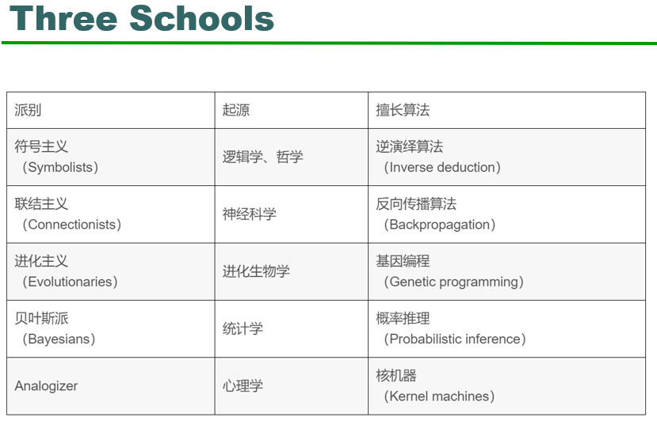

1. What is AI

   - 试图对人的智力思想进行建模并应用的计算机系统的研究
   - 计算机科学的一个分支，处理计算机中智能行为的模拟
   - 机器模仿人类智能行为的能力

2. What is intelligence

   - 研究人员希望机器表现出的特征是感知、推理、知识、计划、学习、交流以及理性移动和操纵物体的能力

3. Strong AI：具有与人类完全相同的意识的机器

   Weak AI：具有智能行为的机器

   广义的AI：能够将智能应用于任何问题的机器

   狭义的AI：AI专注于一项狭窄的任务，当前所有现有的AI系统最多都是Weak AI

4. 图灵机/Robinson的完整逻辑推理算法

   1990 机器学习的兴起

   **知识**主要由计算机学习

   **有监督的学习**：分类，回归

   给出一些示例输入输出对，学习一个从输入映射到输出的函数。

   **无监督学习**：关联规则学习，聚类

    根据类别未知(没有被标记)的训练样本解决模式识别中的各种问题，称之为无监督学习 

   **深度学习**：人工神经网络

5. What is cognitive modeling

   认知模型用于在计算机模型中模拟人类解决问题和进行心里处理的过程

   这样的模型可以模拟/预测人类在于建模相似的任务上的行为/表现，并改善人机交互性

   ​				/ Cognitive Modeling\

   ​			/			behavioural		\

   ​		/					Physical				\

   ​	/						Kinematic				\

   /							Geometric					\

6. Types of cognitive modeling

   - 神经网络 Neural network

     神经网络通过大量称为人工神经元的计算节点运行训练数据，从而与人脑类似地工作，这些计算节点之间相互传递信息。 通过以这种分布式方式累积信息，应用程序可以对未来的输入进行预测。

   - 强化学习 Reinforcement learning 根据一系列奖励或惩罚来决定该做什么。

     这种方法的算法贯穿任务的多次迭代，需要多个步骤，以激励最终产生积极结果的行动，同时惩罚导致消极结果的行动。

   这些模型还可以用于自然语言处理和智能助手应用程序中，改善了人机交互性，使机器与人进行基本对话成为可能。

7. 潜在限制

   尽管在将认知模型应用于人工智能方面取得了进步，但它仍未达到模拟人类思维的真实目标。

    人脑结合上下文和更多有限的经验来对新体验进行概括，即使是最先进的认知模型也无法做到这一点。对人脑的最先进的生物学研究仍然缺乏关于其工作原理的完整描述。 

8. What is knowledge representation

   知识表示（KR）是人工智能（AI）领域，致力于以一种计算机系统可以用来解决诸如诊断医疗状况或以自然语言进行对话之类的复杂任务的形式来**表示有关世界的信息**。

   知识表示法**结合了心理学中有关人类如何解决问题和表示知识的发现**，以设计形式主义，这将使复杂的系统**更易于设计和构建**。
    知识表示和推理还**结合了逻辑的发现，以自动化各种推理**，例如规则的应用或集合与子集的关系。

   例子：语义网/系统架构/框架/规则/本体论

9. What is automatic reasoning

   自动推理可以说是人工智能的最早应用领域。其产品包括大量推理技术和策略。它**使用演绎推理来解决问题**。

   例子：

   构建正式的数学证明 / 验证程序符合其规范 / 模拟人类推理。

   - **自动推理的工具和技术包括：**

     经典逻辑和计算 / 模糊逻辑 / 贝叶斯推理 / 用最大熵推理

   - **证明系统**

     Boyer-Moore定理证明器（NQTHM）全自动定理证明器 / HOL Light / Coq自动校对助手

10. What is machine learning

    机器学习是一门科学，它使计算机像人类一样学习和行动，并**通过以观察和真实交互的形式向计算机提供数据和信息**，从而随着时间的流逝以**自主方式改善其学习**。

11. How is machine learning work

    计算机程序（相对于人类）可以从经验E（例如标记的数据）中学习某些类别的任务T（例如分类）和绩效指标P（例如精度和召回率）。 其在T任务中的绩效（以P衡量）随着经验E的提高而提高。

12. AI 三大流派

    Symbolism(符号主义) / Connectionism(连接主义) / Behaviorism(行为主义)

    

13. 符号主义

     符号主义（Symbolism）是一种**基于逻辑推理的智能模拟方法**，又称为逻辑主义(Logicism)、心理学派(Psychlogism)或计算机学派(Computerism)，其原理主要为**物理符号系统（即符号操作系统）假设和有限合理性原理**

     早期的人工智能研究者绝大多数属于此类。  符号主义的实现基础是纽威尔和西蒙提出的**物理符号系统假设**。该学派认为：**人类认知和思维的基本单元是符号**，而**认知过程就是在符号表示上的一种运算**。它认为人是一个物理符号系统,**计算机也是一个物理符号系统**,因此,我们就能够用计算机来模拟人的智能行为,即用计算机的符号操作来模拟人的认知过程。  

     启发式算法->专家系统->知识工程理论与技术 

14. 连接主义

    连接主义也被称为仿生学或生理学。 它是一种**基于神经网络之间的连接机制和学习算法的智能仿真**方法。

    典型代表技术：**Artificial neural network (ANN)**  / **Backpropagation**（反向传播算法）/ The Google Cat Network / Neural network and Deep learning（深度学习的概念源于人工神经网络的研究。）

15. 行为主义

    行动主义，也称为进化论或控制论，是一种**基于“知觉行为”的智能行为模拟方法**。

    行为是有机体用来适应环境变化的各种身体反应的组合。 **其理论目标是预测和控制行为**。

    **控制论**将神经系统的工作原理与信息论，控制论，逻辑和计算机联系起来

    - 遗传算法

16. 其他流派

    贝叶斯派别

    **Analogizers** **(类推比较)**

      核心思想：新旧知识间的相似性

    代表算法：**Nearest Neighbor** / **Kernel Machines** / **Recommender Systems** 

17. The key problem of AI

    人工智能和机器人的关键问题是缺乏物理学和社会常识。 这是人工智能研究的最大障碍。

18. What is common sense?

    常识是我们在世界和社会中生存的最基本知识：

    - 最常使用
    - 它可以用来推断和帮助获得其他知识。

    这是人工智能研究的核心问题。

19. A\*算法

    Admissibility (可采纳)： h(n) <= h*(n)  

    > ​     *h\* (n) be the* cost of an optimal path from n to a goal node (*∞* if there is no path).   

    Consistency(一致性)/monotonicity(单调性)：

    for any nodes n1 and n2，h(n1)  <= c(n1 -> n2)  + h(n2)

    对于两个启发式函数h1，h2，如果对于任何节点n，h2(n)>h1(n),那么就说h2比h1占优势。优势可以直接转化为效率。

     一个松弛问题的最优解代价是原问题的可采纳的启发式。 

20. Minimax strategy and Alpha beta pruning

    Min-Max算法的时间复杂度为  **O(bm)** ，其中b为博弈树的分支因子，m为博弈树的最大深度。

    空间复杂度为**O(bm)**

    极大极小算法的主要缺点是，对于复杂的游戏，如国际象棋、围棋等，它会变得非常慢。这类游戏有一个巨大的分支因素，玩家有很多选择。

21. Constraint Satisfaction Problems 

    有效解决CSP

    - 变量和取值顺序
      1. 选择“合法”取值最少的变量——称为最少剩余值（MRV）启发式。（做一个强有力的引导，方便提早遇到失败，从而剪枝） 
      2. 度启发式：通过选择与其他未赋值变量约束最多的变量来试图降低未来的分支因子。（用来打破僵局，如选择第一个着色区域）
      3.  最少约束值：优先选择的赋值是给邻居变量留下更多的选择（为了找到一个解，所以没必要排序，而是要最少约束） 